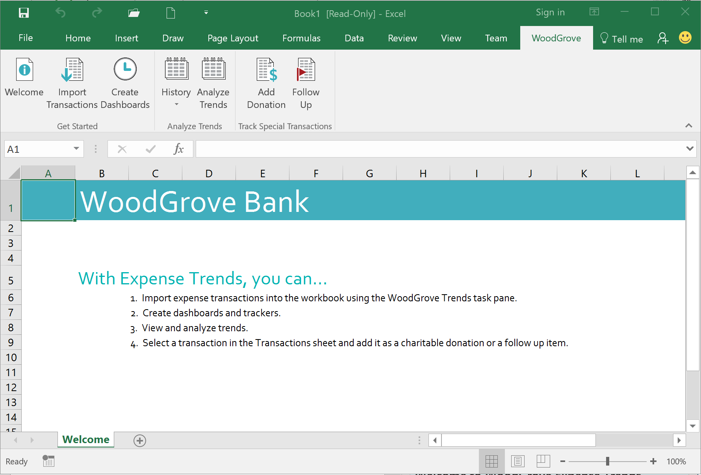
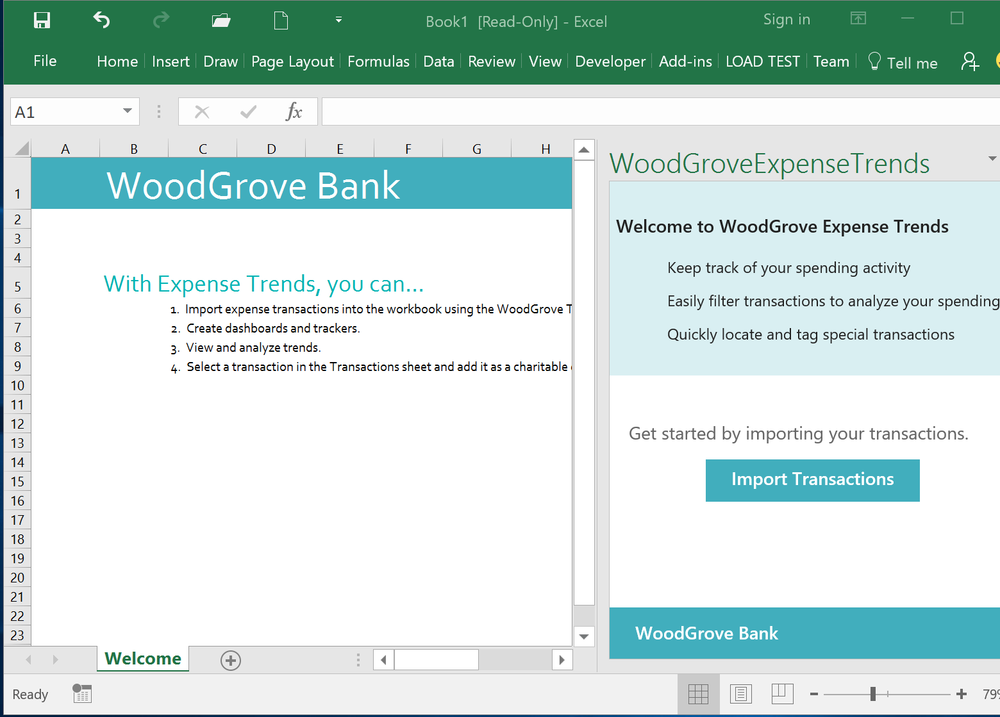

    <article class="markdown-body entry-content" itemprop="text">
        <h1>
            <a id="user-content-excel-add-in-js-woodgrove-expense-trends" class="anchor" href="#excel-add-in-js-woodgrove-expense-trends" aria-hidden="true">
                <svg aria-hidden="true" class="octicon octicon-link" height="16" version="1.1" viewBox="0 0 16 16" width="16">
                    <path d="M4 9h1v1H4c-1.5 0-3-1.69-3-3.5S2.55 3 4 3h4c1.45 0 3 1.69 3 3.5 0 1.41-.91 2.72-2 3.25V8.59c.58-.45 1-1.27 1-2.09C10 5.22 8.98 4 8 4H4c-.98 0-2 1.22-2 2.5S3 9 4 9zm9-3h-1v1h1c1 0 2 1.22 2 2.5S13.98 12 13 12H9c-.98 0-2-1.22-2-2.5 0-.83.42-1.64 1-2.09V6.25c-1.09.53-2 1.84-2 3.25C6 11.31 7.55 13 9 13h4c1.45 0 3-1.69 3-3.5S14.5 6 13 6z"></path>
                </svg>
            </a>Excel-Add-in-JS-WoodGrove-Expense-Trends
        </h1>
        
The WoodGrove Bank Expense Trends add-in demonstrates how you can use the new JavaScript API for Microsoft Excel 2016 to create a compelling Excel add-in. With Expense Trends, you can import expense transactions into the workbook, create dashboard and trackers, view and analyze trends, and track special transactions such as charitable donations and follow up items. The sample provides two experiences: one with task pane and another with add-in commands. The following figures show the main screens of this add-in.

        <h2>
            <a id="user-content-table-of-contents" class="anchor" href="#table-of-contents" aria-hidden="true">
                <svg aria-hidden="true" class="octicon octicon-link" height="16" version="1.1" viewBox="0 0 16 16" width="16">
                    <path d="M4 9h1v1H4c-1.5 0-3-1.69-3-3.5S2.55 3 4 3h4c1.45 0 3 1.69 3 3.5 0 1.41-.91 2.72-2 3.25V8.59c.58-.45 1-1.27 1-2.09C10 5.22 8.98 4 8 4H4c-.98 0-2 1.22-2 2.5S3 9 4 9zm9-3h-1v1h1c1 0 2 1.22 2 2.5S13.98 12 13 12H9c-.98 0-2-1.22-2-2.5 0-.83.42-1.64 1-2.09V6.25c-1.09.53-2 1.84-2 3.25C6 11.31 7.55 13 9 13h4c1.45 0 3-1.69 3-3.5S14.5 6 13 6z"></path>
                </svg>
            </a>Table of Contents
        </h2>
        <ul>
            <li>
                <a href="#prerequisites">Prerequisites</a>
            </li>
            <li>
                <a href="#run-the-project">Run the project</a>
            </li>
            <li>
                <a href="#additional-resources">Additional resources</a>
            </li>
        </ul>
        <h2>
            <a id="user-content-prerequisites" class="anchor" href="#prerequisites" aria-hidden="true">
                <svg aria-hidden="true" class="octicon octicon-link" height="16" version="1.1" viewBox="0 0 16 16" width="16">
                    <path d="M4 9h1v1H4c-1.5 0-3-1.69-3-3.5S2.55 3 4 3h4c1.45 0 3 1.69 3 3.5 0 1.41-.91 2.72-2 3.25V8.59c.58-.45 1-1.27 1-2.09C10 5.22 8.98 4 8 4H4c-.98 0-2 1.22-2 2.5S3 9 4 9zm9-3h-1v1h1c1 0 2 1.22 2 2.5S13.98 12 13 12H9c-.98 0-2-1.22-2-2.5 0-.83.42-1.64 1-2.09V6.25c-1.09.53-2 1.84-2 3.25C6 11.31 7.55 13 9 13h4c1.45 0 3-1.69 3-3.5S14.5 6 13 6z"></path>
                </svg>
            </a>Prerequisites
        </h2>
        
You'll need:

        <ul>
            <li>
                <a href="https://www.visualstudio.com/downloads/download-visual-studio-vs.aspx">Visual Studio 2015</a>
            </li>
            <li>
                <a href="https://www.visualstudio.com/en-us/features/office-tools-vs.aspx">Office Developer Tools for Visual Studio</a>
            </li>
            <li>Excel 2016, version 6769.2011 or later</li>
        </ul>
        <h2>
            <a id="user-content-run-the-project" class="anchor" href="#run-the-project" aria-hidden="true">
                <svg aria-hidden="true" class="octicon octicon-link" height="16" version="1.1" viewBox="0 0 16 16" width="16">
                    <path d="M4 9h1v1H4c-1.5 0-3-1.69-3-3.5S2.55 3 4 3h4c1.45 0 3 1.69 3 3.5 0 1.41-.91 2.72-2 3.25V8.59c.58-.45 1-1.27 1-2.09C10 5.22 8.98 4 8 4H4c-.98 0-2 1.22-2 2.5S3 9 4 9zm9-3h-1v1h1c1 0 2 1.22 2 2.5S13.98 12 13 12H9c-.98 0-2-1.22-2-2.5 0-.83.42-1.64 1-2.09V6.25c-1.09.53-2 1.84-2 3.25C6 11.31 7.55 13 9 13h4c1.45 0 3-1.69 3-3.5S14.5 6 13 6z"></path>
                </svg>
            </a>Run the project
        </h2>
        <ol>
            <li>Copy the project to a local folder. Ensure that the file path is not too long, otherwise you might run into an error in Visual Studio when it tries to install the NuGet packages necessary for the project. </li>
            <li>Then open the 
                <code>WoodGrove Expense Trends.sln</code> in Visual Studio.
            </li>
            <li>Press F5 to build and deploy the sample add-in. Excel launches and depending on the version of Excel 2016 you've, the add-in loads a custom tab called WoodGrove in the ribbon, or opens in a task pane to the right of the worksheet, as shown in the following figures.</li>
        </ol>
        

            
        

        

            
        

        <h2>
            <a id="user-content-additional-resources" class="anchor" href="#additional-resources" aria-hidden="true">
                <svg aria-hidden="true" class="octicon octicon-link" height="16" version="1.1" viewBox="0 0 16 16" width="16">
                    <path d="M4 9h1v1H4c-1.5 0-3-1.69-3-3.5S2.55 3 4 3h4c1.45 0 3 1.69 3 3.5 0 1.41-.91 2.72-2 3.25V8.59c.58-.45 1-1.27 1-2.09C10 5.22 8.98 4 8 4H4c-.98 0-2 1.22-2 2.5S3 9 4 9zm9-3h-1v1h1c1 0 2 1.22 2 2.5S13.98 12 13 12H9c-.98 0-2-1.22-2-2.5 0-.83.42-1.64 1-2.09V6.25c-1.09.53-2 1.84-2 3.25C6 11.31 7.55 13 9 13h4c1.45 0 3-1.69 3-3.5S14.5 6 13 6z"></path>
                </svg>
            </a>Additional resources
        </h2>
        <ul>
            <li>
                <a href="http://dev.office.com/">Office Dev Center</a>
            </li>
        </ul>
        <h2>
            <a id="user-content-copyright" class="anchor" href="#copyright" aria-hidden="true">
                <svg aria-hidden="true" class="octicon octicon-link" height="16" version="1.1" viewBox="0 0 16 16" width="16">
                    <path d="M4 9h1v1H4c-1.5 0-3-1.69-3-3.5S2.55 3 4 3h4c1.45 0 3 1.69 3 3.5 0 1.41-.91 2.72-2 3.25V8.59c.58-.45 1-1.27 1-2.09C10 5.22 8.98 4 8 4H4c-.98 0-2 1.22-2 2.5S3 9 4 9zm9-3h-1v1h1c1 0 2 1.22 2 2.5S13.98 12 13 12H9c-.98 0-2-1.22-2-2.5 0-.83.42-1.64 1-2.09V6.25c-1.09.53-2 1.84-2 3.25C6 11.31 7.55 13 9 13h4c1.45 0 3-1.69 3-3.5S14.5 6 13 6z"></path>
                </svg>
            </a>Copyright
        </h2>
        
Copyright (c) 2016 Microsoft. All rights reserved.

    </article>

